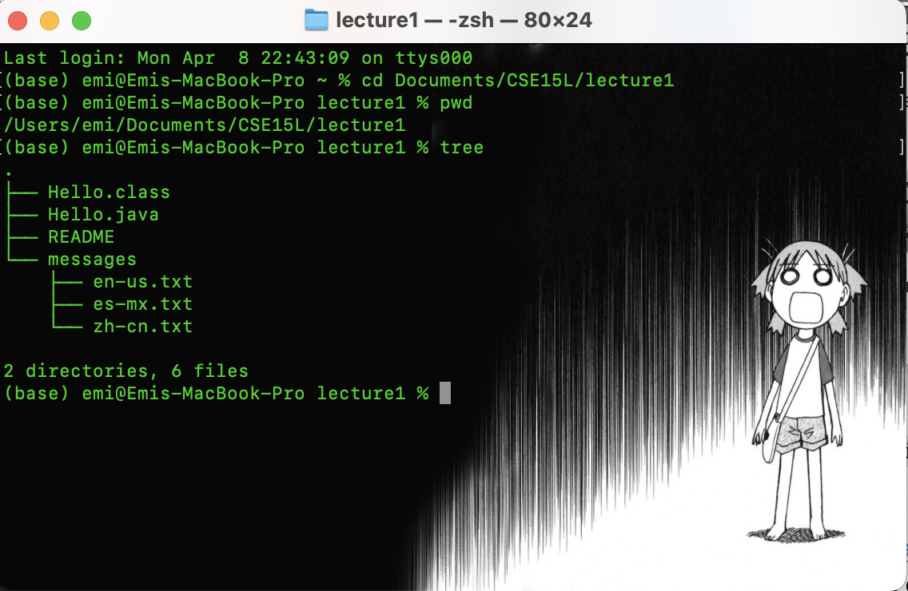
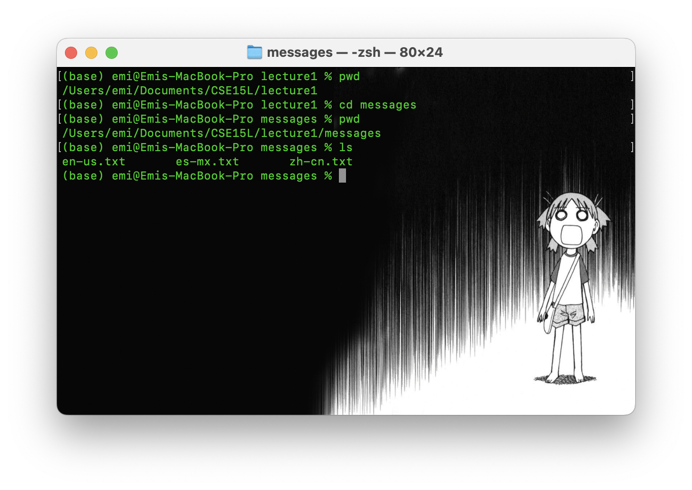
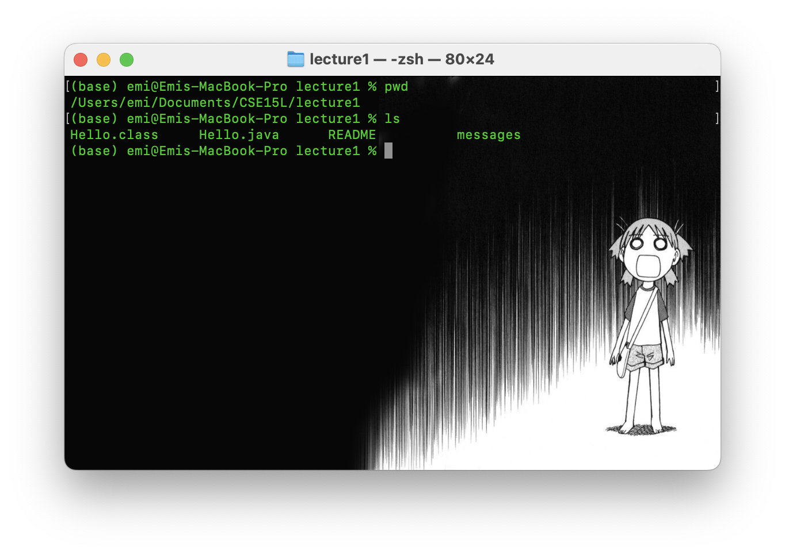
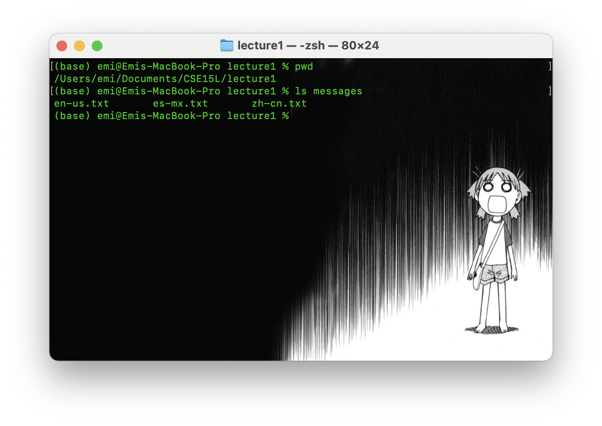
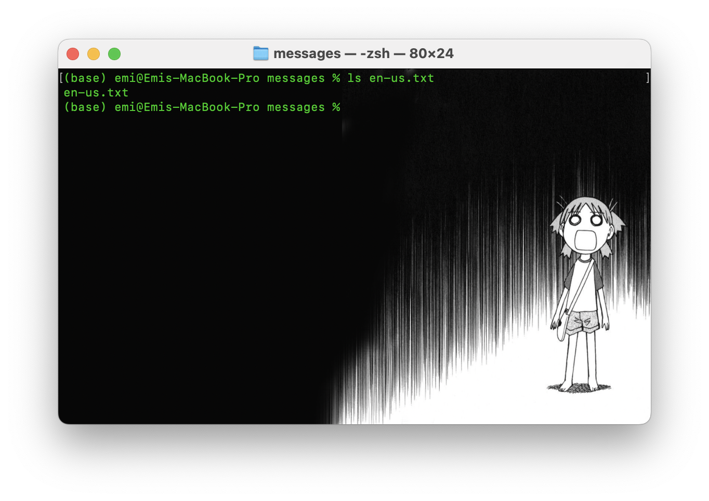
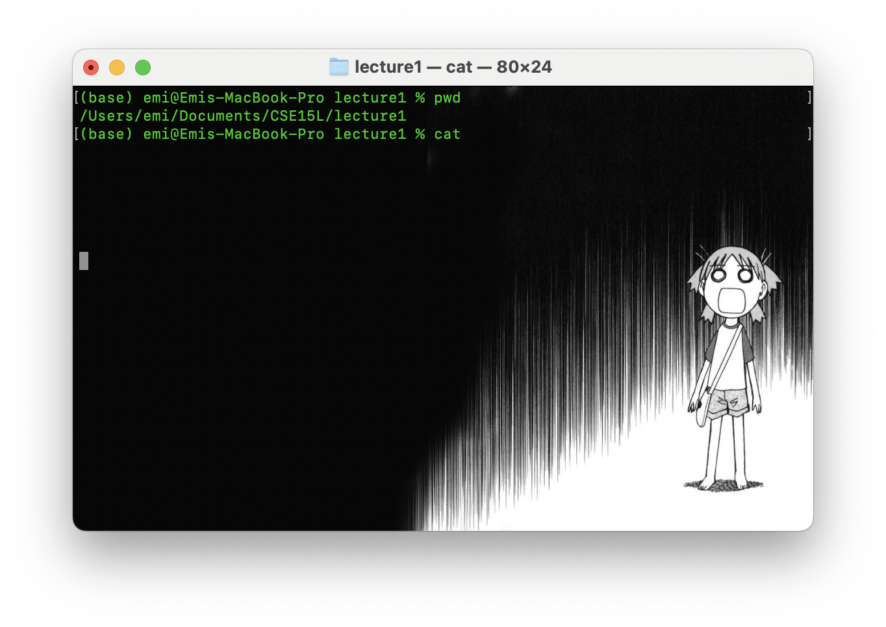
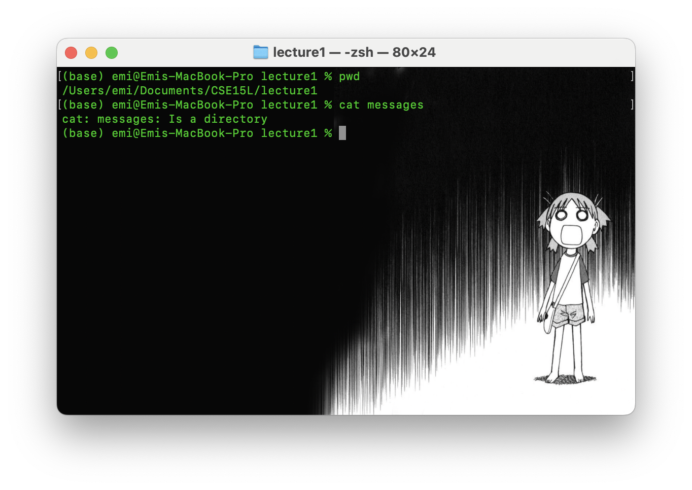
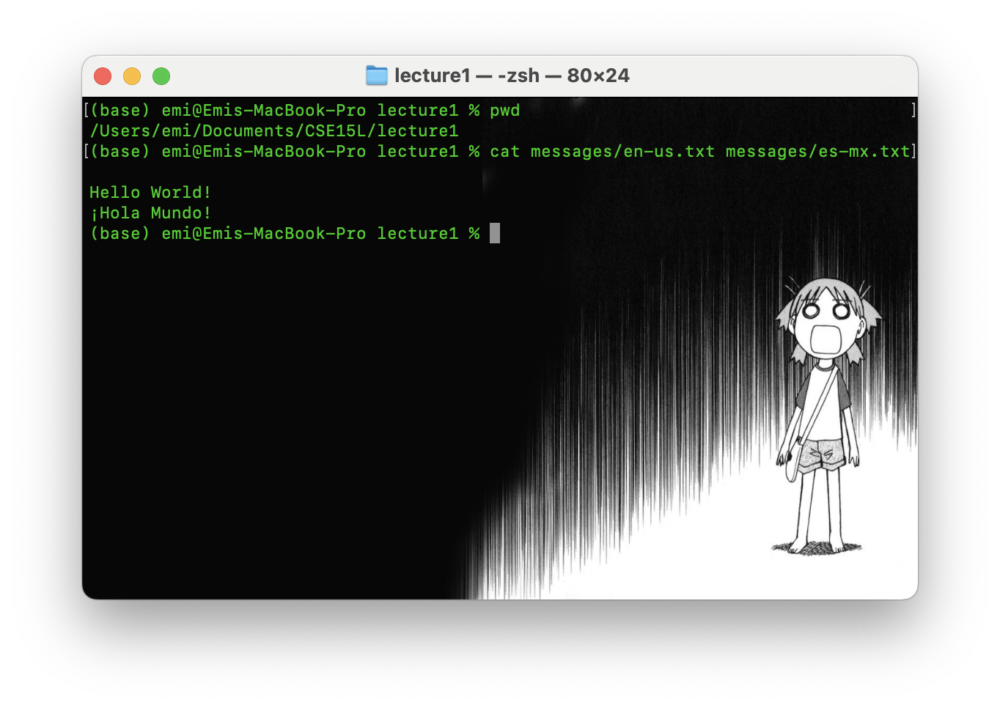

# Lab report 1 

In week one we learned about basic filesystem commands such as: 
- ``cd``
- ``ls``
- ``cat``

In this lab report, I will break down how eaach command works and different use case scenarios such as in a command with no arguments, command with a path to a directory as an argument, and command with a path to a file as an argument! 

Before we start, lets examine the contents of the lecture1 file that we will be using in several of the use cases: 

This will be references several times throughout this entry so keep the layout in mind! 

## cd
The first of the commands we learned was cd, which stands for 'change directory'. As the name suggests, this name can take you to and from files or directories or even to root given a certain argument. 

Typically the syntax is: 
``cd [absolute or relative path]``

Depending on the argument, if it is not absolute, the working directory must be checked before attempting to change paths to make sure the file path exists! 

That being said, I will walk through the various use cases. 

### cd + no argument 

Starting from working directory ``/Users/emi/Documents/CSE15L/lecture1`` when ``cd`` is inputted with no argument (meaning no variable or input after it) it takes you back to the home directory, ``/Users/emi`` . This is due to the fact that in Unix, when cd is input without an argument its default behavior is to take you back to home. Alternatively ``cd ~`` will have the same effect. 

### cd + path to a directory 

Starting from working directory ``/Users/emi/Documents/CSE15L/lecture1`` when ``cd`` is inputted with a relative path ``messages`` it takes you into the ``messages`` directory (shown by using ``ls`` to reveal the directory's files). Because it is a relative path to a directory inside ``lecture1`` it is easily able to correctly find and change directories to ``messages`` and displays normal behavior. However, when using relative paths, special attention should be directed to if that path even exists and if you are actually changing to a directory as this can cause unexpected behaviors or even errors. 

### cd + path to a file 

Starting from working directory ``/Users/emi/Documents/CSE15L/lecture1/messages`` when ``cd`` is inputted with a relative path to ``en-us.txt`` an error appears. This is due to the fact that, as stated by the name, this command is meant to change to directories, not file paths, thus causing the error as there is nothing to 'dive' further into. 

## ls
``ls`` stands for 'list files' and is a command that allows you to view all the files in your current directory! 

The syntax is usually:
``ls [path]``

That being said, lets look at the use cases! 

### ls + no argument 

Starting from working directory ``/Users/emi/Documents/CSE15L/lecture1`` , using ``ls`` with no arguments will print all the files in ``lecture1`` as it is our current working directory, and most importantly a directory with files inside. This is expected behavior, and so long as the working directory is in fact a directory, it should return all the files inside. 

### ls + path to a directory 

Starting from working directory ``/Users/emi/Documents/CSE15L/lecture1/messages`` , we use ``ls`` with the relative path to the ``messages`` directory. Like when we used ``ls`` on the working directory in the previous example, because ``messages`` is a directory, it will return all the files in ``messages`` the expected behavior.  

### ls + path to a file 

Starting from working directory ``/Users/emi/Documents/CSE15L/lecture1/messages`` , ``ls`` when given a relative path to ``en-us.txt`` only returns the name of the file: ``en-us.txt``. This behavior, while not an error, returns only the file name ``en-us.txt`` as it is the only file in the path. Thus, it is best to use this on directories as otherwise this may be redundant depending on the goal. 

## cat 
Lastly, we have ``cat`` . ``cat`` stands for concatnate and allows you to view the contents of a file or multiple files! 

The syntax of ``cat`` is usually: 
``cat [path1] [path2] ... [path#]``

Lets see how it works with different use cases! 

### cat + no argument 

Starting from working directory ``/Users/emi/Documents/CSE15L/lecture1`` when ``cat`` is used with no argument, it will not return anything, instead letting you input and write. This is because when ``cat`` does not have an argument, in Unix, the default behavior is to take standard input, in other words, cat will process (read) whatever you type in terminal and print it back out unless you input a redirect that create a new .txt file to put the typed contents in. 

### cat + path to a directory 

Starting from working directory ``/Users/emi/Documents/CSE15L/lecture1`` , when ``cat`` is given a relative path to directory ``messages`` , it gives a output: ``cat: messages: is a directory``. As the goal of ``cat`` is to read the contents of a file, this behavior is undesireable and is the case because ``messages`` is not a readable file, but instead a directory. Thus, to correct for this error, ``cat`` must be fed a file instead.

### cat + path to a file 

Starting from working directory ``/Users/emi/Documents/CSE15L/lecture1`` , when cat is given a relative path to ``messages/en.us.txt`` and ``messages/es-mx.txt`` it returns the contents of both files, in its respective orders on seperate lines. This is expected behavior from ``cat`` , as it follows the order of file paths and prints the contents of the files, if any, as output. 