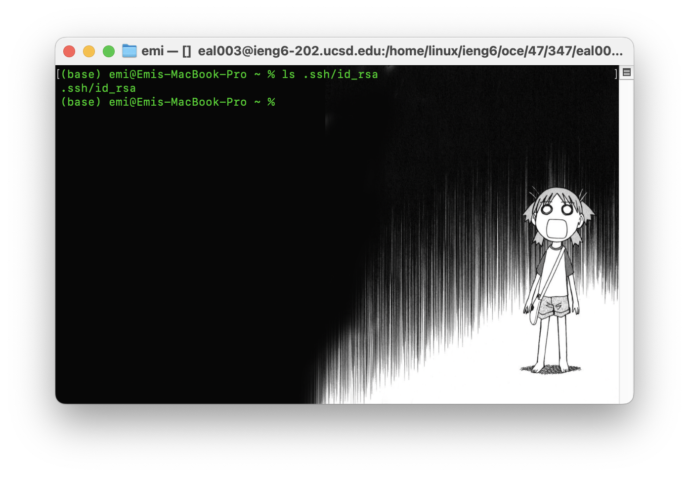

# Lab Report 2

In this lab report, I will demonstrate and walk through the concepts learned throughout weeks 2-3. The two main topics covered will be: 
- URLS
- SSH and Keys

Lets begin!

## Part 1: Chatserver and URLS
To demonstrate our understanding of URLs this week we were tasked with making a ChatServer class which can take a query of a user and a message and display it accordingly. The code is as follows: 

````java 
import java.io.IOException;
import java.net.URI;
import java.util.ArrayList;

class Handler implements URLHandler {
    //initializes variables to store users, messages, and chat history     
    ArrayList<String> users = new ArrayList<>();
    ArrayList<String> messages = new ArrayList<>();
    String chat = "\n"+chatConcat(users, messages);

    //function to concatnate users and messages respectively and returns a string of the entire chat history
    public String chatConcat(ArrayList<String> users, ArrayList<String> messages){
        String concat_str = "";
        //check that users and messages list are same len
        if(users.size()==messages.size()){
            for(int i = 0; i<users.size(); i++){
                //concatnate string to return
                 concat_str = concat_str+users.get(i)+" : "+messages.get(i)+'\n';
            }
        }else{
            //if not the same string, return a message and a blank concat so that chat isnt affected 
            System.out.print("users and messages array are not the same length!");
        }
        return(concat_str);
    }
    //function to get path and queries, displaying the chatlog
    public String handleRequest(URI url) {
        if (url.getPath().equals("/")) {
            //returns chatlog as is without queries 
            return String.format("Current Chatlog: %s", chat);
        } else {
            //takes add-message and splits user and chat
            //request format: /add-message?s=<string>&user=<string>
            if (url.getPath().contains("/add-message")) {
                //splits at query
                String[] parameters = url.getQuery().split("=");
                //checks that both message and user parameter exist 
                if ((parameters[0].equals("s"))&&((((parameters[1].split("&"))[1]).equals("user")))) {
                    //adds users and message string appropriately
                    users.add(parameters[2]);
                    messages.add((parameters[1].split("&"))[0]);
                    //update chat
                    chat = chatConcat(users, messages);
                    return String.format("Current Chatlog: %s", chat);
                }else{
                    String err = "Input is in the incorrect format! Requires both string and user.";
                    return err;
                }
            }
            return "404 Not Found!";
        }
    }
}

class ChatServer{
    public static void main(String[] args) throws IOException {
        if(args.length == 0){
            System.out.println("Missing port number! Try any number between 1024 to 49151");
            return;
        }

        int port = Integer.parseInt(args[0]);

        Server.start(port, new Handler());
    }
}

````

As mentioned above, the query takes two string input parameters of message denoted after ``s=`` and user denoted after ``user=``

For a general instance the two following methods are called: 

``chatConcat(ArrayList<String> users, ArrayList<String> messages)``
- **Purpose**: concatnates the arraylist of users to the messages associated at the same index in the other arraylist
- **Arguments**: Takes ``ArrayList<String> useres`` and ``ArrayList<String> messages)``
- **Field changes**: No fields change 


``handleRequest(URI url)``
- **Purpose**: concatnates the arraylist of users to the messages associated at the same index in the other arraylist
- **Arguments**: Takes ``URI`` object ``url``
- **Field changes**: ``String chat`` , a variable that holds the current string of user-message pairs is declared and is updated every time ``/add-message`` is used with the appropriate query parameters after the message is processed by ``chatConcat``. In ``handlerequest`` method ``ArrayList`` ``users`` and ``messages`` are updated with their respective query parameters from the URL passed and are appended.  

In the demonstration below, the chatroom shows a "conversation" using the path query and the code based off of popular internet cartoon: Azumanga Daiyo! . 

The first image and second image have the same behaviors as the parameters are passed through the methods in the code. Lets break it down: 


Like mentioned above, ``handleRequest(URI url)`` takes the url ``http://localhost:4000/add-message?s=America%20ya&user=Ayumu_Kasuga`` , getting the parameters message string ``"America ya"`` and user ``"Ayumu_Kasuga"`` due to ``/add-message``. The message and user is appended appropriately to ``ArrayList`` ``messages`` and ``users``  respectively then processed by ``chatConcat`` which returns a string to update the ``String`` ``chat`` variable, which was previously empty, with ``Ayumu_Kasuga : America ya\n``.


Similarly again ``handleRequest(URI url)`` takes the url ``localhost:4000/add-message?s=Hallo :3&user=Chihiro`` , getting the parameters message string ``"Hallo :3"`` and user ``"Chihiro"`` due to ``/add-message``. The message and user is appended appropriately to ``ArrayList``  ``messages`` and ``users`` respectively then processed by ``chatConcat`` which returns a string to update the ``String`` ``chat`` variable which replaces the string ``Ayumu_Kasuga : America ya\n`` with ``Ayumu_Kasuga : America ya\nChihiro : Hallo :3`` 


## Part 2: SSH and Keys
This week we learned about SSH keys which can make the secure shell signin alot smoother. This allows us to login by leaving a "piece" of us to the remove server (the public key) which will get matched to the private key on our local device. This will tell the remote server that this is , in fact, us and to let us in!

My public key in ieng6 is stored here in authorized key file: 

Whereas my private key on my local is stored here:


While I cant show my actual key, these two combined allow me to sign in without a password to ieng6! 

## Part 3: Learning new things! 
Lastly, this week I learned alot about my gaps in knowledge. More specifically, my gaps in knowledge regarding querying in URLS. Due to my focus on data science I was not interacting with URLs or at least intentionally interacting with them as much as I thought and was heuristically navigating-- knowing what to change but not why or how it worked.

Now that I was able to explore this concept in class, I have a much better idea of how the different parameters of a URL path conceptually work, and was a pretty cool demystification for me! 
