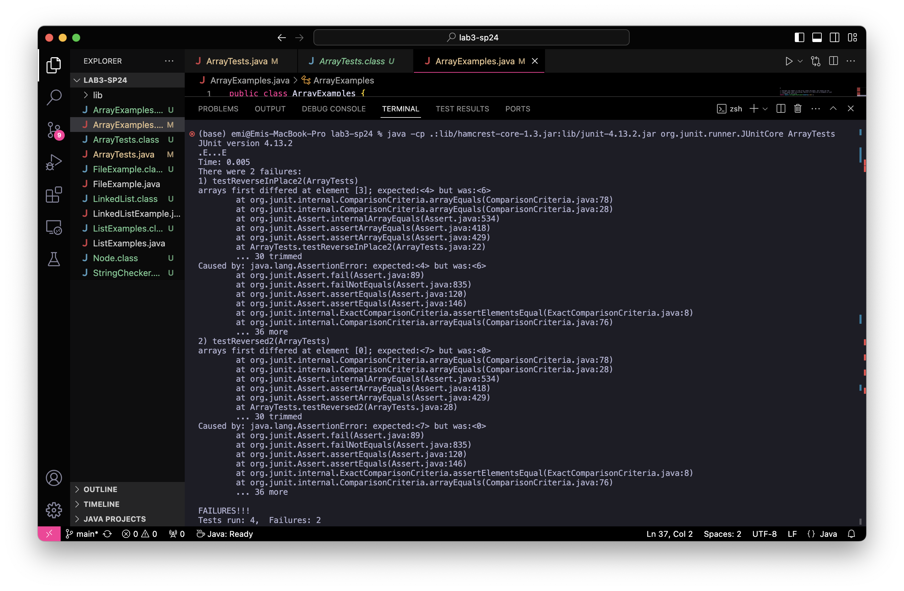
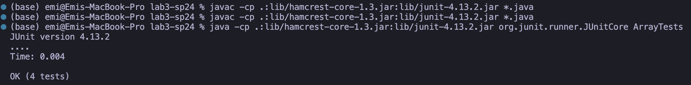
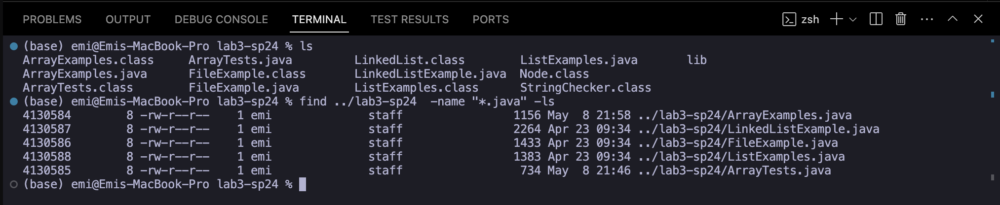
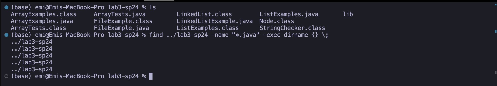
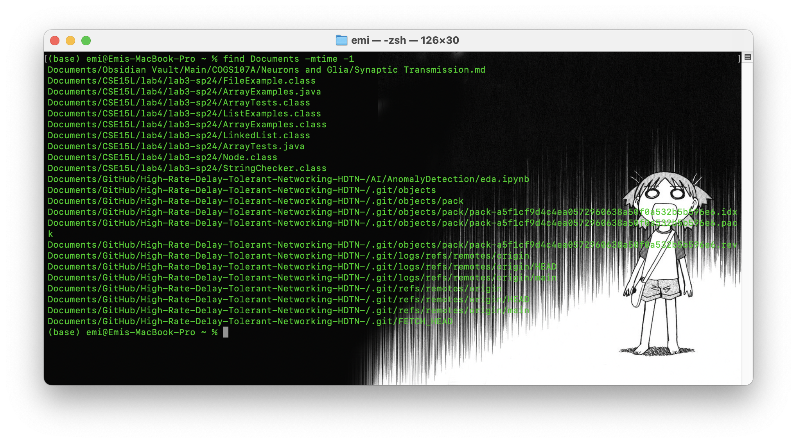

# Lab Report 3

These past weeks we have been focusing on debugging and testing, with a concentration on specifically learning to use JUnit to write tests. This being said, we were encouraged to focus on these topics as well as expand upon our current bash command toolkit which I will be covering in the following sectionts: 

- Bugs and writing tests 
- Researching commands

## Bugs and writing tests
Writing tests and debugging is an important part of the process of development, after all, we are not perfect and we need to know how to anticipate base and edge cases when writing robust code. In this section I will recap this past weeks lab as an example and provide cases of how thorough JUnit testing can help detect bugs and errors.

### The original code 
To get started, lets take a look at the code from week 4's lab. 

```java 
public class ArrayExamples {

  // Changes the input array to be in reversed order
  static void reverseInPlace(int[] arr) {
    for(int i = 0; i < arr.length; i += 1) {
      arr[i] = arr[arr.length - i - 1];
    }
  }

  // Returns a *new* array with all the elements of the input array in reversed
  // order
  static int[] reversed(int[] arr) {
    int[] newArray = new int[arr.length];
    for(int i = 0; i < arr.length; i += 1) {
      arr[i] = newArray[arr.length - i - 1];
    }
    return arr;
  }

  // Averages the numbers in the array (takes the mean), but leaves out the
  // lowest number when calculating. Returns 0 if there are no elements or just
  // 1 element in the array
  static double averageWithoutLowest(double[] arr) {
    if(arr.length < 2) { return 0.0; }
    double lowest = arr[0];
    for(double num: arr) {
      if(num < lowest) { lowest = num; }
    }
    double sum = 0;
    for(double num: arr) {
      if(num != lowest) { sum += num; }
    }
    return sum / (arr.length - 1);
  }

}
```

While this code runs and may seem correct to the unsuspecting eye, unit tests can help us confirm this. 

### Tests 
During this lab we were tasked with writing test cases, below are two cases that we have written. We will later find out that one of these cases will cause a failure inducing input, and the other, will pass. Lets take a closer look:

```java
@Test 
	public void testReverseInPlace2() {
    int[] input1 = { 3 , 4, 5, 6, 7 };
    ArrayExamples.reverseInPlace(input1);
    assertArrayEquals(new int[]{ 7,6,5,4,3 }, input1);
	}
```

```java
@Test 
	public void testReverseInPlace() {
    int[] input1 = { 3 };
    ArrayExamples.reverseInPlace(input1);
    assertArrayEquals(new int[]{ 3 }, input1);
	}
```

To find out we can run them by compiling the test files and running them with
```bash
javac -cp .:lib/hamcrest-core-1.3.jar:lib/junit-4.13.2.jar *.java
java -cp .:lib/hamcrest-core-1.3.jar:lib/junit-4.13.2.jar org.junit.runner.JUnitCore ArrayTests
```

This will produce the following output: 


As shown above, the first test fails and the second test passes showing that , for this specific example, there is a problem when the ``reverseInPlace`` method; And upon further inspection, shows that with lists longer than 1 element, indexing issues occur.

Lets fix it! 

Because the issue mainly pertains to indexing and how the list is stored, lets examine the method itself. 

```java
  // Changes the input array to be in reversed order
  static void reverseInPlace(int[] arr) {
    for(int i = 0; i < arr.length; i += 1) {
      arr[i] = arr[arr.length - i - 1];
    }
  }
```

As seen in the for loop, there is a bug where elements in the beginning of the array are being overwritten as the array is being traversed, causing issues for arrays longer than 1 element. This explains why our test case with 1 element passed, where our test case with more than one element failed. 

To fix this, we can create a temp array to hold our new elements as we traverse the original array. The code looks something like this: 

```java
  // Changes the input array to be in reversed order
  static void reverseInPlace(int[] arr) {
    int[] arr_temp = new int[arr.length];
    for(int i = 0; i < arr.length; i += 1) {
      arr_temp[i] = arr[arr.length - i - 1];
    }
    for(int i = 0; i < arr.length; i += 1) {
      arr[i] = arr_temp[i];
    }
  }
```

By creating a temp array, we cut out the risk of overwriting completely, preventing the bug.

We then fixed similar errors in other methods in addition to this one, for the following revised code:
```java


public class ArrayExamples {

  // Changes the input array to be in reversed order
  static void reverseInPlace(int[] arr) {
    int[] arr_temp = new int[arr.length];
    for(int i = 0; i < arr.length; i += 1) {
      arr_temp[i] = arr[arr.length - i - 1];
    }
    for(int i = 0; i < arr.length; i += 1) {
      arr[i] = arr_temp[i];
    }
  }

  // Returns a *new* array with all the elements of the input array in reversed
  // order
  static int[] reversed(int[] arr) {
    int[] newArray = new int[arr.length];
    for(int i = 0; i < arr.length; i += 1) {
      newArray[i] = arr[arr.length - i - 1];
    }
    return newArray;
  }

  // Averages the numbers in the array (takes the mean), but leaves out the
  // lowest number when calculating. Returns 0 if there are no elements or just
  // 1 element in the array
  static double averageWithoutLowest(double[] arr) {
    if(arr.length < 2) { return 0.0; }
    double lowest = arr[0];
    for(double num: arr) {
      if(num < lowest) { lowest = num; }
    }
    double sum = 0;
    for(double num: arr) {
      if(num != lowest) { sum += num; }
    }
    return sum / (arr.length - 1);
  }

}
```

Now that we've diagnosed the issue, all tests should run and return an output like this: 


Yay! Bug resolved. 

## Researching Commands 
Another focus from this week was getting more familiar with useful commands such as ``less``, ``find``, and ``grep``. As someone with questionable file organization skills, I have a hunch mastering ``find`` will be incredibly useful to me in the near future, and thus will focus on introducing 4 new, useful use cases of the ``find`` command.

To learn about these use cases , I scoured a variety of sources, which will be linked in each section. 

### Recursive find
``find [path and pattern (optional)] -ls`` is a command that will enable you to find everything recursively in a path , with the option to add a pattern to narrow your search. 

#### Example

Recursively finds all files ending in .java in the directory

Source: [RedHat Official](https://www.redhat.com/sysadmin/linux-find-command)


### Find and execute
``find [path or and pattern (optional)] -exec [command] {} \;`` is an incredibly useful command that enables you to execute a command on all found files that match the  pattern.

#### Example

Prints the directory that all files in the current working directory that end in .java are located in

Source: [GeeksforGeeks](https://www.geeksforgeeks.org/find-command-in-linux-with-examples/)

### Finding by modification date
``find [path or and pattern (optional)] -mtime [number of days or range of days]`` is a really quick way to find files by modification date, which will really come in handy for constantly changing folders, or for people like me with bad file naming habits (test1, test1new, test1newnew, ... etc ¯\\\_(ツ)_/¯ (I will eventually change out of this (hopefully)))

#### Example 
 
Shows the files that have been modified in my ``Documents/`` folder within the last day ``-1``

Source: [GeeksforGeeks](https://www.geeksforgeeks.org/find-command-in-linux-with-examples/)

### Finding by content 
``find [path] -type f -exec grep -l [pattern/text] {} \;`` will let you find all files with a matching string stored within the file by executing (``-exec``) ``grep`` to do this. 

#### Example

Found every file (cut off) in my ``Documents/`` folder containing "the". By using -il instead of just -l we can make the text search case sensitive.

Source: [GeeksforGeeks](https://www.geeksforgeeks.org/find-command-in-linux-with-examples/)

### Sources
- https://www.redhat.com/sysadmin/linux-find-command
  - Recursive find
- https://www.geeksforgeeks.org/find-command-in-linux-with-examples/
  - Find and execute
  - Finding by modification date
  - Finding by content 
