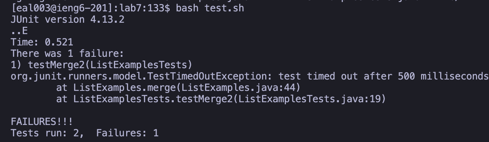
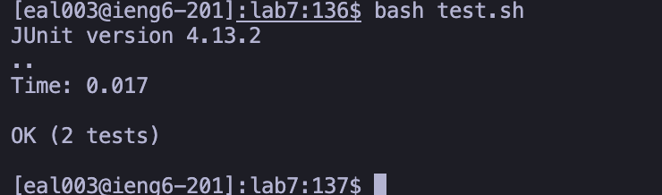
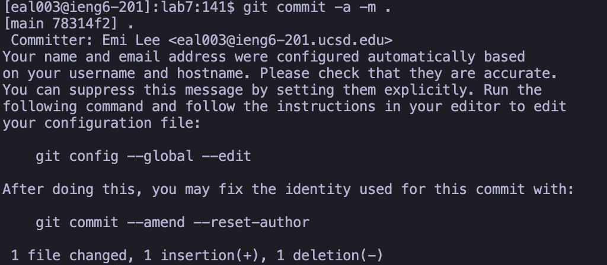

# Lab Report 4

This past week, we learned about vim , a text editor tool that can edit text and code files from terminal. This being said, this lab report will showcase a "speedrun" of sorts where I will demonstrate how fast some of the manual work can all be done from the same place: the terminal. 

Like any speedrun there will be some unkosher shortcuts that will be mentioned.

## The speedrun

The base time for this run is ~70 seconds. This is largely due to the amount of time pressing arrow keys. 

I was honestly a bit shocked at how long this took me despite trying to be fast. My exact reaction (seen above).

> Note: The following screenshots were not captured live for the sake of saving time. They were captured after the fact however still demonstrate the steps taken. 

Starting the clock : 

1. SSH into ieng6

Since I have used this command before, I accessed my history for a quick retype using: 
``<Ctrl> + R + ssh <Enter>`` 

2. Clone the SSH url 

Using the same technique as above I did the same with git clone only typing in the bare minimum for it to be retrieved up from my history: ``<Ctrl> + R + git cl <Enter>`` 

This was fairly short so I used the standard cd command with the bare minimum to get lab7 to autofill from the working directory:  ``cd la <tab>``

3. Compile + Run tests 

To compile was a straightforward process, doing the same technique above to do the bare minimum, then appending ``.java`` because tabbing only brings up the filename: 
``javac L <Tab> .java <Enter>``

I found a shell script in the directory to run my tests for me so I ran the shell script using ``bash`` and only added what was necessary for it to autocomplete: 
``bash te <tab> <Enter>``

4. Edit code

As writing it out was rather short, I wrote out ``vim`` and the bare minimum for autocomplete: 
``vim Lis <tab> <Enter>``

I did though have a bit of an advantage here as I knew exactly where the line that was causing errors was. Given that vim lets me use my mouse, I accessed the line that way instead of arrow keys which I did in my initial run. I edited the line using insert mode, made the edit, and wrote out and saved: 
``<mouse> i <backspace> 2 <esc> :wq <Enter>``

5. Recompile 

To recompile, since I used the same method as step 3, only putting in the bare minimum necessary for autocomplete: 
``javac L <Tab> .java <Enter>``

I figure it may be more efficient to press up until it goes to when I first wrote this out, but I figured due to my propensity for making weird mistakes this was a better way.

6. Rerun test

Used same command as step 3, again pulling up the shell script with autocomplete: 
``bash te <tab> <Enter>``

7. Commit the code back to GH

Seeing as I've committed before in my first run, I once again use the history to complete my autofill: 
``<Ctrl> + R + git co <Enter>`` 

End. Time: 49.1 seconds 

While still a bit lethargic in speed despite the having the inorganic edge of practicing, using tricks like tab or the mouse as well as knowing where the error was greatly increased my speed. Being slow was unexpectedly frustrating so I will practice more and hopefully become more proficient in this new skill! 

